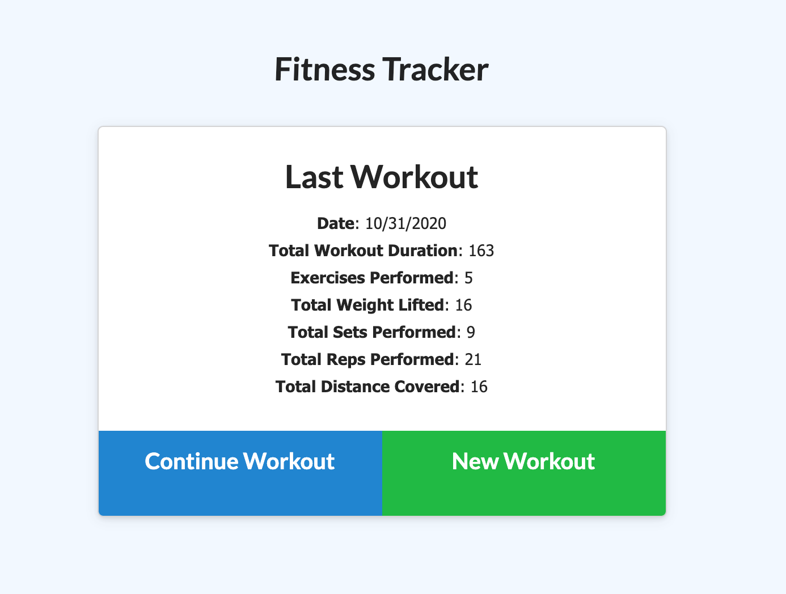
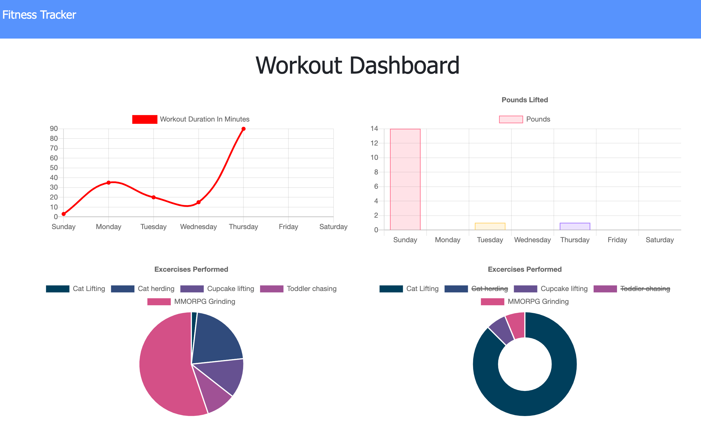

# Fitness Tracker
[](https://api.github.com/licenses/mit)




https://frightening-alien-02910.herokuapp.com/

## Table of Contents:

- [Section 1: Description](#Description)
- [Section 2: Installation](#Installation)
- [Section 3: Usage](#Usage)
- [Section 4: License](#License)
- [Section 5: Contributing](#Contributing)
- [Section 6: Questions](#Questions)

## Description
This project is a simple and clear exercise logging tool made with JavaScript and MongoDB to store data. It gives the user the ability to create and continue workouts, add exercises to those workouts, and view their activity in a dashboard.


## Installation
You can access this project through any internet capabale browser. To work on the code itself, download the files from the GitHub repository, run 
```
npm install 
```
to get all the dependencies. This does require a local MongoDB for development and you can seed your db using 
```
npm run seed
```
You can also utilize a cloud service like MongoDB Atlas. You would then declare your personal connection string as URI in a .env file which should reside in your base directory.

## Usage
Simply run 
```
npm start
```
and navigate to the localhost port displayed

you can view a live demo here: [Deployed App](https://frightening-alien-02910.herokuapp.com/)

## License
* MIT (LICENSE)

## Contributing
To contribute open a pull request. 

## Questions
* Contact [n-lambert](https://github.com/n-lambert)

  
